
# Evolving 3D Morphologies
[See full video](https://youtu.be/H5rHEVx5wYA)
## Overview
To generate a 3D morphology, I recursively branched out constituent boxes with varying probability. Unlike my 1D morphology, I chose not to use spheres and arbitrarily rotated cylinders. In 3D they lead to too many cases where the morphology would be hard to connect and control. I also used revolute joints to connect the boxes, which are much easier to control than other joint types. The brain is a fully connected network from the sensors to the joints. The number of links is random normal between 3 and 9 (mean = 5, std = 2). To evolve the morphology, one of several types of mutations can be chosen (see evolution section).

## Explanation
The majority of the fundamental logic is stored in morphology.py. There, the logic behind genotype generation, mutation, and storage is kept. Solution.py is a wrapper, almost, which can interpret a morphology object to send to pyrosim. Of other importance, parallelHillClimber.py controls the selection (see description below). 

Solutions are found with search.py and viewed with view.py (see final section for instructions on how to use each; I made a nice interface for each).

Observations
* Smaller morphologies often perform better than larger one for the simple task of locomotion
    * The slug like movement behavior is common, and reliable.
    * The more moving parts that are added, the more that goes wrong.
    * Most "best" solutions were 3 or 4 links, despite choosing from initial link size from  N(5, 2)
        * Possible this is biased because I delete link with twice probability of adding link; though if deleting was worse it wouldn't replace parent
* Large solutions which worked tended to move slowly

* Enforcing height ceiling vital for limiting "glitch jumping" morphologies
* Fitness plot shows most solutions similar in final fitness
    * Solution 10, doubled the majority of other best fitnesses without any glitching (simple 3 link morphology)
        *  We can impose bound and say the majority of solutions were less than half way to the optimal morphology after 500 generations
    * Single change can lead to very rapid fitness growth. I hypothesis mutations that lead to a high fitness derivative are body morphology changes, but I leave this for future work.
        * In contrast, gradual changes are possibly the result of brain mutations.

Watch video (linked at top) to view evolution in action. You will see lineages evolve and behaviors change. Notice how despite the primordial soup being chaotic at times, solutions tend to be reduced in complexity. 

You will see one case in the video where, after 100 generations, 0 locomotion was learned, as if the evolution was stuck. It turns out having a sensor is pretty important, and when morphologies lack one they don't attempt to move.

## Recursive Methodology for Initial Genotype Creation
* For the dimension the box was branching out in, the box is between sizes 1.1 and 2.2. For the other two dimensions, the box is between sizes 0.2. and 0.4.
    * This gives the effect of the boxes being longer in one direction, creating more stick like structures and branches. This also reduces the chances of collisions.
    * With probability of 0.1, each one of the two other dimensions can be set to the larger range, creating large, flat boxes.
* For a given box, 3 branches will come off it with probability 0.25, 2 with probability 0.25, and 1 with probability 0.5.
    * The direction of a branch is chosen in the current direction of travel with probability 0.4, and in other directions with probability 0.3.
    

    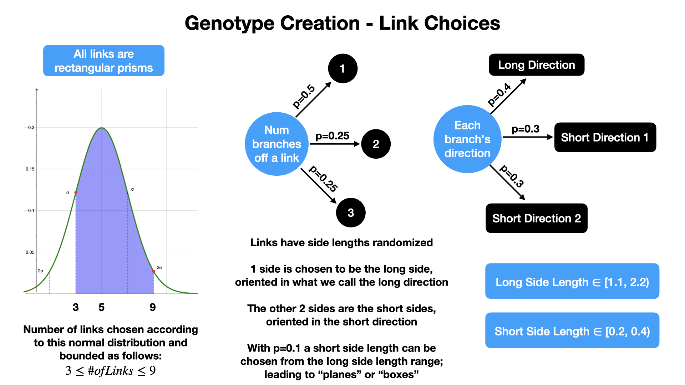

* The joint axis is chosen to be revolute in any, or multiple, arbitrary directions.
    * After experimentation with other joint types, it was found they frequently caused odd behavior and collisions. Thus I chose to stick with revolute joints. For mutation, I allow joint types to become fixed too.
* Joints are always placed in the center of a face
* There is a joint between any two adjacent links

    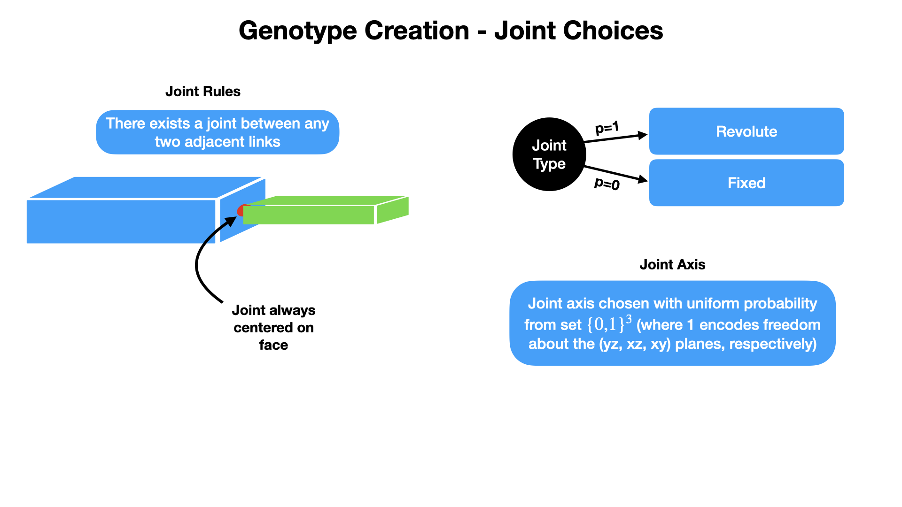

* Finally, a box is a sensor with p=0.5.

Here is an example of a toy genotype's phenotypical representation, using info from before.

    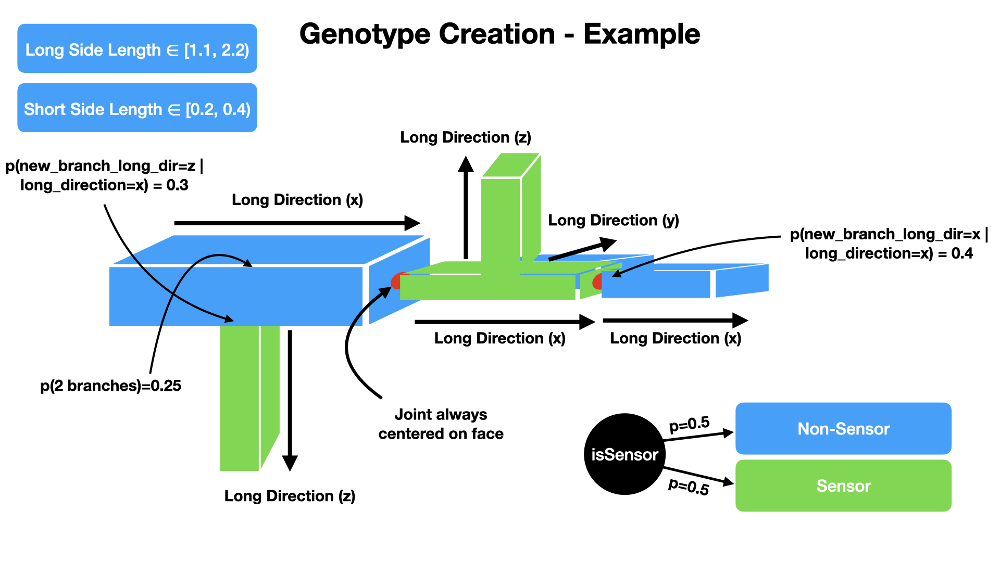

## Genotype Storage

The genotype is stored in a pair of joint and link arrays. Each element has several properties used to map the genotype to the phenotype. The mapping between genotypes and phenotypes is 1-1.

    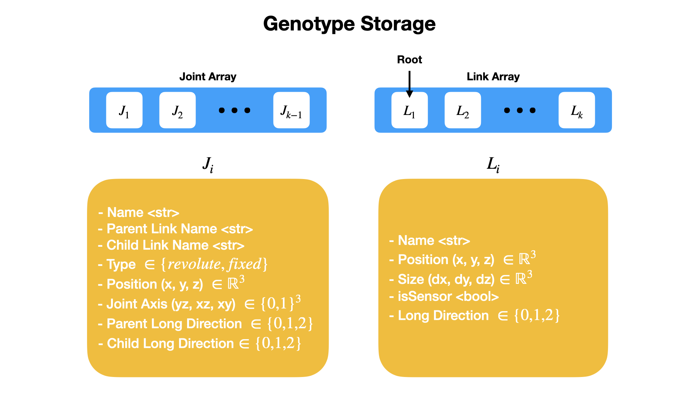

## Brain Creation and Storage
The brain is a fully connected neural network that connects all sensor inputs to all joint outputs. The elements are random between [-1, 1). It is stored in a 2D array.

    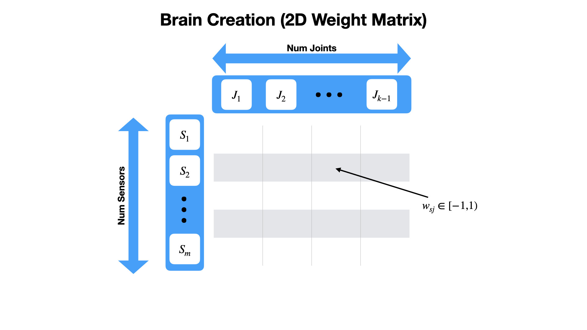

## Evolution
### Mutation
One mutation happens on every generation. The following are possible mutations which can occur and their corresponding probabilities:

    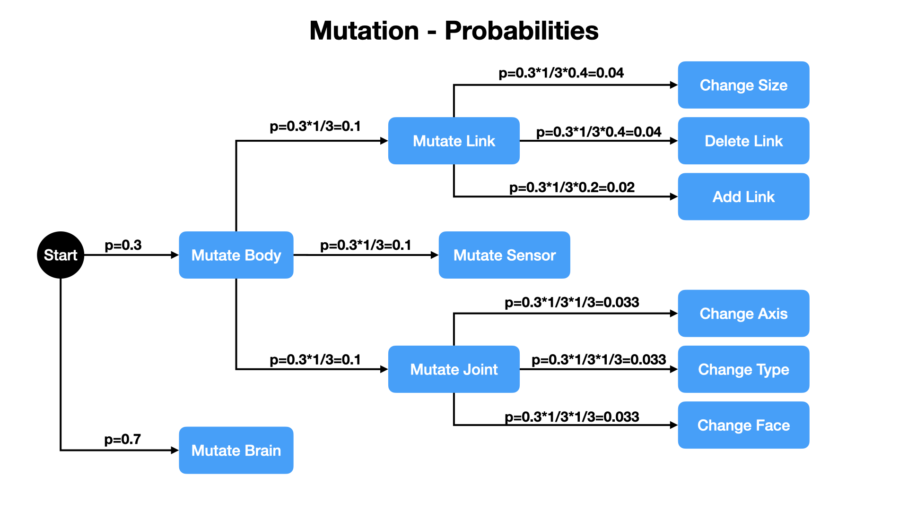

* Mutate Brain (p=1/2): This is simply changing a weight in the brain to some value in [-1, 1).

    
  
        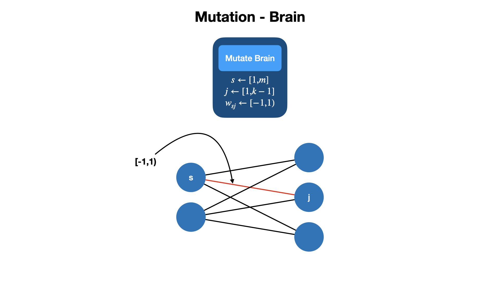
    

* Mutate Body (p=1/2):
    * Mutate Joint (p=1/3):
        * Change Face (p=1/3): Change the face of the link which the joint is attached to. This also changes downstream link's placement, but not orientation.
        * Change Axis (p=1/3): Change the axis of the joint. This is a random choice from all possible degrees of freedom a revolute joint can have.
        * Change Type (p=1/3): Change the type of the joint to one of revolute or fixed with equal probability.

        

            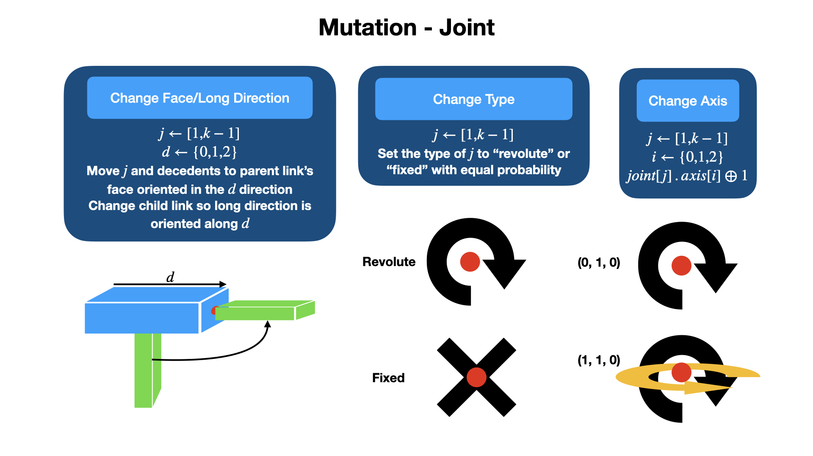
        

    * Mutate Link (p=1/3): 
        * Change Size (p=0.4): Change the length of a side of a link according to the initialization rules
        * Delete (p=0.4): Delete a terminal link
        * Add (p=0.2): Add a link to a terminal link
    * Mutate Sensor (p=1/3): Swap the isSensor trait of two links if they are different.

        

            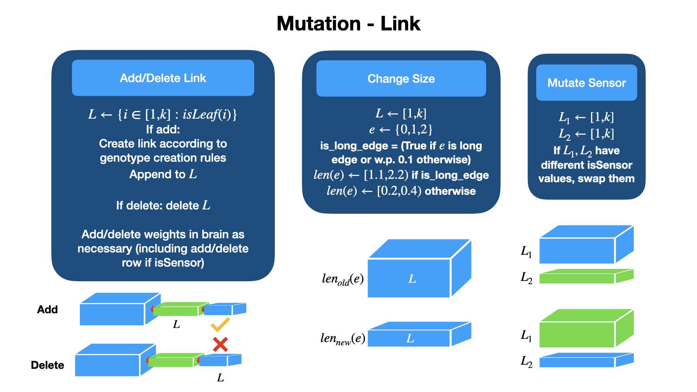
        

### Selection Parallel Hill Climber

A parallel hill climber is used to select children. A child takes its parents place if its fitness is better than its parent's fitness. The hill climber is run in parallel on 10 morphologies for 500 generations. This is repeated 10 times, each with different initial morphologies.
    

    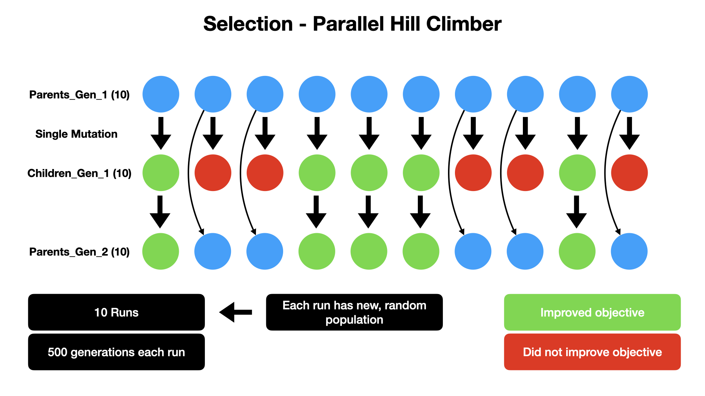

## Motor
The motor power is set to 15 to reduce unrealistic behavior.
Joint motor range is multiplied by a desired motor range of 0.8, reducing strange motions.

## Fitness
### Ignoring Broken Morphologies
Some morphologies would spawn into the floor causing the fitness to be NaN. Whenever this occurs, a new morphology is generated to take the old ones place. If a child is the one which is broken, that morphology simply doesn't replace the parent. The child is assigned infinite fitness. In some cases, the design will shoot itself into the air. This is more common with large morphologies, but in any event it is undesirable. To prevent this, I set a maximum height for the morphology (z=3). If the morphology exceeds this height, it is assigned infinite fitness.

### General Fitness Function
Minimize the position in the x direction. In the fitness plot, the abs value of the x position is used to make the graph more readable (up is good).

    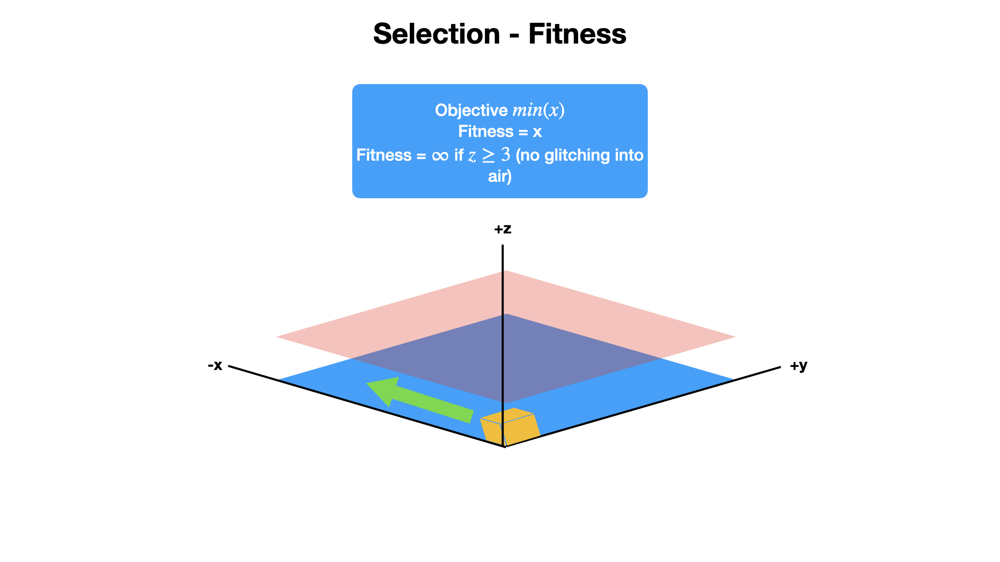

### Fitness Curves

    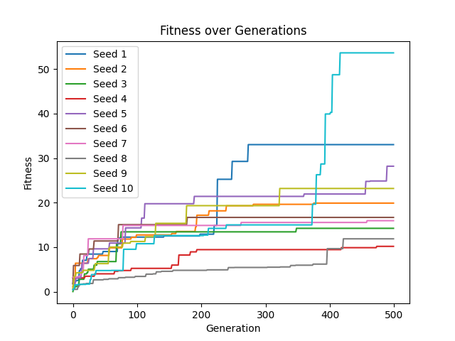

## Morphospace
The morphospace is a 3D collection of boxes which branch out in perpendicular directions. Since the revolute joints can modify these angles, the various branches can span a wider range of angles (more so than just the orthogonal directions). The brain connects every sensor to every joint, meaning that any sensor node can affect the movement of any joint. This allows for a wide range of behaviors. It seemed a common design pattern was minimizing the number of links. The morphologies which did remain large were usually chaotic and launched themselves in some way. Though, these were also the ones that "worked" the best, mostly by beating the simulation. In general, the small solutions were more realistic, and would likely perform better in a real world scenario. That is also the logic behind choosing the number of links from N(5, 2), bounded between 3 and 9, and making deleting a link twice as likely as adding one.

## Running
Download ./main.sh and run it with execute privileges (chmod +x). This script will download my repo and all the requirements, then run view.py. This will show the best result in all of the runs. Note that you need python3 and git to run this.

### Viewing Specific Runs
I have embedded easy viewing functionality via view.py. You will notice a folder called saved_morphs in the repo with 10 runs. Each run has saved data every 100 generations for 10 different solutions. Further, there is a lineage.txt to record which solution is a descendant of which ancestor. To view a specific run, run the following command:
    
    python3 view.py -r <run number> -g <generation number> -s <solution number>

All flags are optional, and omitting them will cause them to take on the following values:

    -r run stored in saved_morphs/best_run.txt
    -g 500
    -s values stored in saved_morphs/<run>/<gen>/best_solution.txt

So simply running 

    python3 view.py

will show the best solution across all runs.

    python view.py -r 4

will show the best solution in run 4.

### Seeing Evolution of a Run
To see the evolution of a run, run the following command:

    python3 view.py --compare -r <run number> -g <generation number> -s <solution number>

This will show how the solution evolved up to that point, one at a time.

### Changing Sim Settings
Using the 
    
    python3 view.py --sleep <sleep_value>

flag allows you to control how long the sim sleeps between each actions. Larger values will slow the simulation down. The default value is 0.002.

### Finding More Solutions
To find more solutions, run the following command:

    python3 search.py

Using the 

    --reset

Flag will clear out saved_morphs, causing a run from scratch.

If you want to rerun a specific run or create new runs on top of what exists, use the

    --runs <run_str>

command with the run_str being of the form a-b,c,d-e,... where all are integers. For example, to run runs 6, 9-11, and 13-15 run

    python3 search.py --runs 6,9-11,13-15

By default, the runs are 1-10. 

Finally, the

    --seed <seed>

flag allows you to set the seed for the random number generator. This is useful for reproducing results. By default, the seed is 22 and all results produced in a specific run are deterministic.

## Citations 
Created for CS 396 - Artificial Life at Northwestern University

This project was built on top of Ludobots and Pyrosim. See links below for further details.

[r/ludobots](https://www.reddit.com/r/ludobots/)

[Pyrosim](https://github.com/ccappelle/pyrosim)