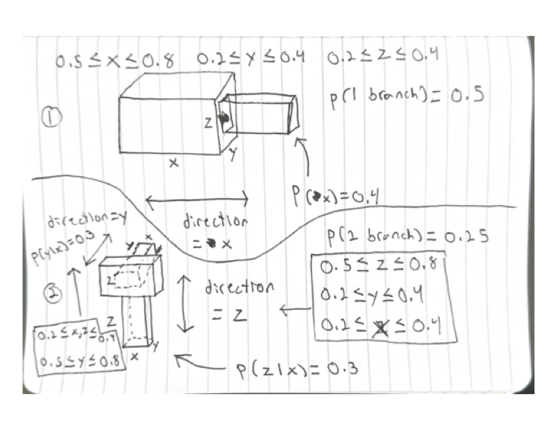
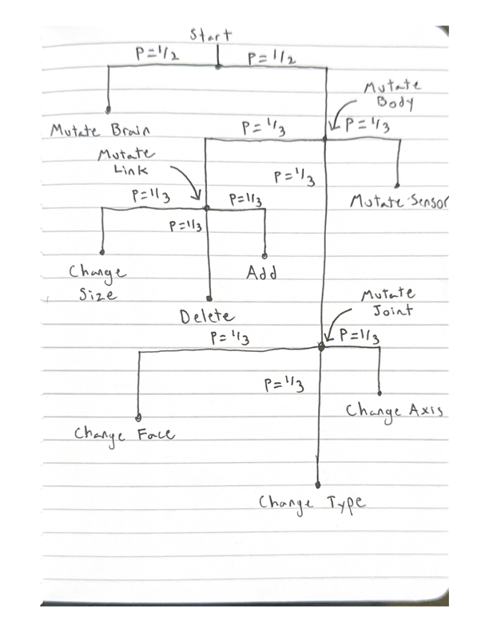
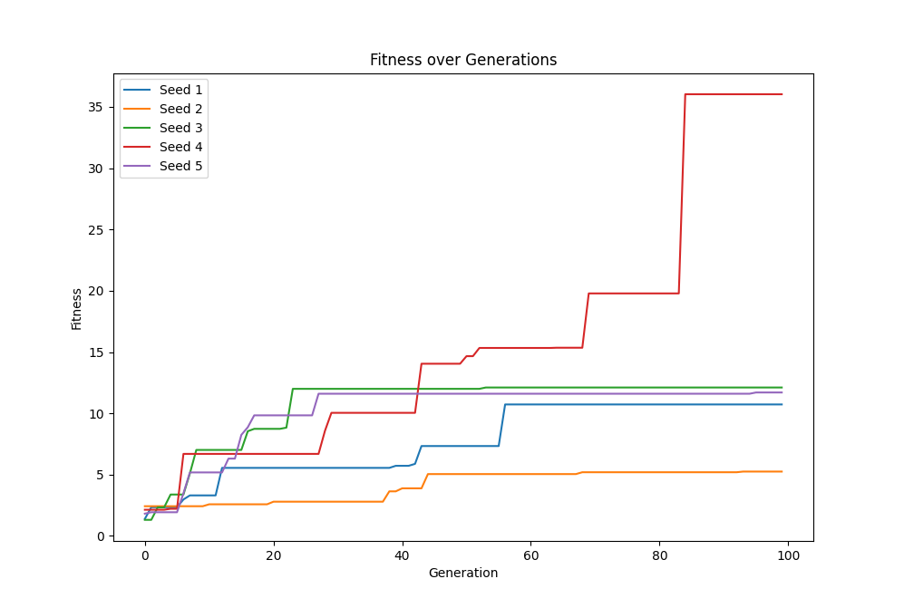

# Evolving 3D Morphologies
Created for CS 396 - Artificial Life at Northwestern University

This project was built on top of Ludobots and Pyrosim. See links below for further details.

[r/ludobots](https://www.reddit.com/r/ludobots/)

[Pyrosim](https://github.com/ccappelle/pyrosim)
## Overview
To generate a 3D morphology, I recursively branched out constituent boxes with varying probability. Unlike my 1D morphology, I chose not to use spheres and arbitrarily rotated cylinders. In 3D they lead to too many cases where the morphology would be hard to connect and control. I also used revolute joints to connect the boxes, which are much easier to control than other joint types. The brain is a fully connected network from the sensors to the joints. The number of links is random between 3 and 8. To evolve the morphology, one of several types of mutations can be chosen (see evolution section).

[Link to video](https://youtu.be/YvX-AV81EEI)

## Recursive Methodology for Initial Creation
* For the dimension the box was branching out in, the box is between sizes 1.1 and 2.2. For the other two dimensions, the box is between sizes 0.2. and 0.4.
    * This gives the effect of the boxes being longer in one direction, creating more stick like structures and branches. This also reduces the chances of collisions.
    * With probability of 0.1, each one of the two other dimensions can be set to the larger range, creating large, flat boxes.
* For a given box, 3 branches will come off it with probability 0.25, 2 with probability 0.25, and 1 with probability 0.5.
    * The direction of a branch is chosen in the current direction of travel with probability 0.4, and in other directions with probability 0.3.
* The joint axis is chosen to be revolute in any, or multiple, arbitrary directions.
    * After experimentation with other joint types, it was found they frequently caused odd behavior and collisions. Thus I chose to stick with revolute joints. For mutation, I allow joint types to become fixed too.
* A box is a sensor with p=0.5.
* Joints are always placed in the center of a face

## Evolution
One mutation happens on every generation. The following are possible mutations which can occur and their corresponding probabilities:

* Mutate Brain (p=1/2): This is simply changing a weight in the brain from -1 to 1.

* Mutate Body (p=1/2):
    * Mutate Joint (p=1/3):
        * Change Face (p=1/3): Change the face of the link which the joint is attached to. This also changes downstream link's placement, but not orientation.
        * Change Axis (p=1/3): Change the axis of the joint. This is a random choice from all possible degrees of freedom a revolute joint can have.
        * Change Type (p=1/3): Change the type of the joint to one of revolute or fixed with equal probability.
    * Mutate Link (p=1/3): 
        * Change Size (p=1/3): Change the length of a side of a link according to the initialization rules
        * Delete (p=1/3): Delete a terminal link
        * Add (p=1/3): Add a link to a terminal link
    * Mutate Sensor (p=1/3): Swap the isSensor trait of two links if they are different.

### Sample Fitness Curve

## Ignoring Broken Morphologies
Some morphologies would spawn into the floor causing the fitness to be NaN. Whenever this occurs, a new morphology is generated to take the old ones place. If a child is the one which is broken, that morphology simply doesn't replace the parent. The child is assigned infinite fitness.

## Motor
The motor power is set to 15 to reduce unrealistic behavior.
Joint motor range is multiplied by a desired motor range of 0.8, reducing strange motions.

## Brain
The brain is a fully connected neural network that connects all sensor inputs to all joint outputs.

## Fitness
Minimize the position in the x direction. In the plot's the abs value of the x position is used to make the graph more readable (up is good).

## Morphospace
The morphospace is a 3D collection of boxes which branch out in perpendicular directions. Since the revolute joints can modify these angles, the various branches can span a wider range of angles (more so than just the orthogonal directions). The brain connects every sensor to every joint, meaning that any sensor node can affect the movement of any joint. This allows for a wide range of behaviors. It seemed a common design pattern was minimizing the number of links. The morphologies which did remain large were usually chaotic and launched themselves in some way. Though, these were also the ones that "worked" the best, mostly by beating the simulation. In general, the small solutions were more realistic, and would likely perform better in a real world scenario.

## Running
Download ./main.sh and run it with execute privileges (chmod +x). This script will download Ludobots and all the requirements, then run search.py. Note that you need python3 and git to run this.

